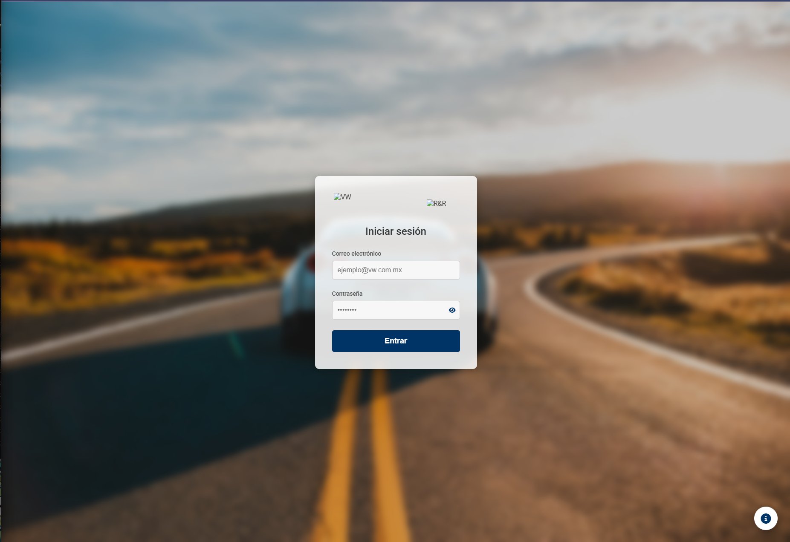
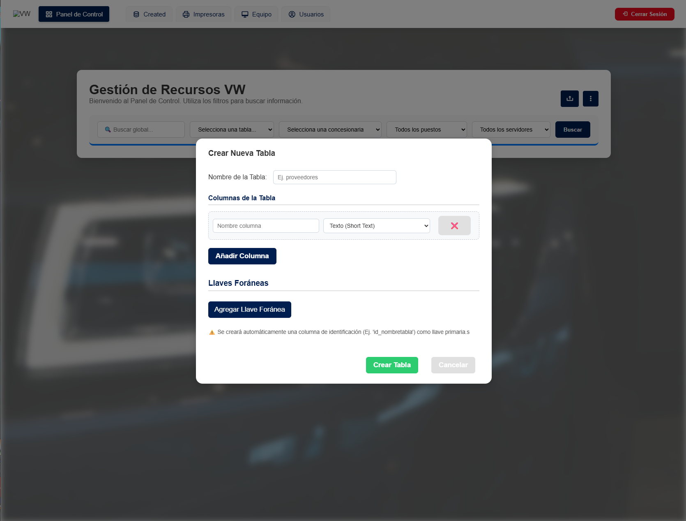
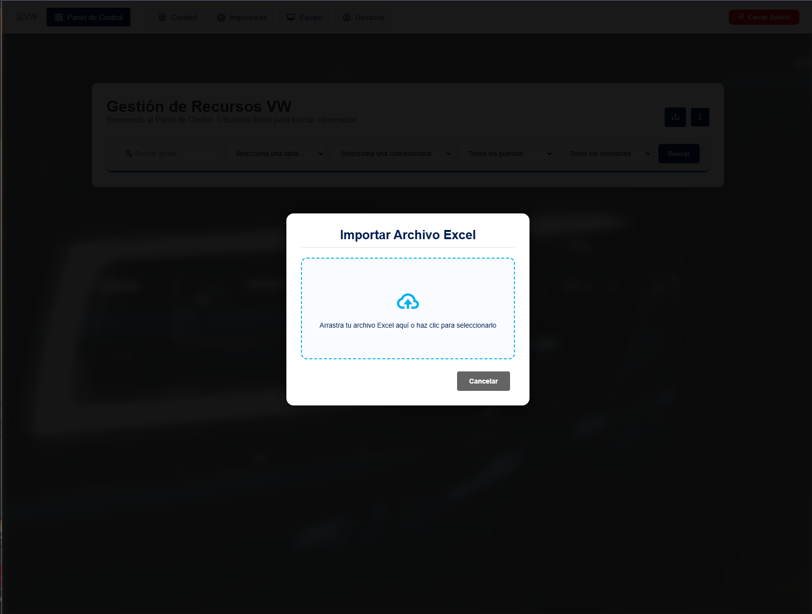

🚗 Gestión Volkswagen

Sistema de gestión dinámica de bases de datos desarrollado con Node.js y MySQL, orientado a la administración flexible de tablas, relaciones y datos mediante una arquitectura modular y escalable.

Este proyecto permite crear, visualizar y administrar estructuras de base de datos de forma automatizada, sin depender de controladores específicos por tabla.

🎓 Proyecto Académico

Este sistema fue desarrollado como parte de mis Residencias Profesionales para la titulación, con el objetivo de demostrar competencias reales en desarrollo de software, incluyendo backend, frontend y bases de datos relacionales.

El proyecto está enfocado en buenas prácticas de arquitectura, seguridad y organización de código, alineadas con entornos profesionales.

🚀 Funcionalidades Principales

*CRUD Dinámico
Controladores genéricos capaces de operar sobre cualquier tabla sin lógica específica por entidad.

*Resolución Automática de Llaves Foráneas (FK)
Búsqueda recursiva para obtener información relacionada entre tablas de forma automática.

*Importación de Datos desde Excel
Procesamiento de archivos .xlsx para carga masiva de información a la base de datos.

*Gestión Dinámica de Estructura
Administración de la arquitectura de la base de datos directamente desde el sistema.

*Interfaz Web Modular
Separación clara entre módulos de autenticación y panel principal.

🧰 Tecnologías Utilizadas
- Node.js
- Express.js
- MySQL
- JavaScript (Vanilla)
- HTML5 / CSS3
- Multer (uploads)
- xlsx (Excel)

📂 Estructura del Repositorio

gestion-volkswagen/
├── backend/        # Servidor Express y lógica de negocio
├── frontend/       # Interfaz de usuario (Auth y Home)
├── database/       # Scripts de base de datos (schema.sql)
├── uploads/        # Archivos temporales
└── README.md

🛠️ Instalación Rápida

1.- Configurar el Backend:
cd backend
npm install

2.- Variables de Entorno: Crea un archivo .env dentro de la carpeta backend/ con tus credenciales de MySQL(usa como guía el archivo .env.example).

3.- Base de Datos: Ejecuta el archivo database/schema.sql en tu gestor de MySQL.

4.- Ejecución:

# En la carpeta backend 
cd backend
node src/server

📸 Capturas de Pantalla

Las imágenes corresponden a un entorno de prueba y no contienen información real.

💡 Lo que demuestra este proyecto

- Diseño de APIs REST
- Arquitectura backend organizada
- Manejo de bases de datos relacionales
- CRUD dinámico y genérico
- Separación frontend / backend
- Buenas prácticas de seguridad (.env, .gitignore)

⚖️ Nota Legal y Académica

Este proyecto fue desarrollado como parte de mis Residencias Profesionales para la titulación.

Finalidad del repositorio:
El código se publica exclusivamente con fines académicos y de portafolio profesional, con el objetivo de demostrar habilidades técnicas en desarrollo de software.

Uso de marcas y nombres comerciales:
Los nombres, logotipos y referencias a Volkswagen y Grupo R&R pertenecen a sus respectivos propietarios.
Su uso dentro de este proyecto se realizó únicamente en un contexto académico y demostrativo, sin fines comerciales.

Protección de la información:
Este repositorio no contiene datos reales, información confidencial ni credenciales sensibles.
Toda la información utilizada es de carácter simulado o académico.

📌 Autor

[Joaquín Ortíz Arias]
Desarrollador de Software
Proyecto de titulación – Portafolio profesional